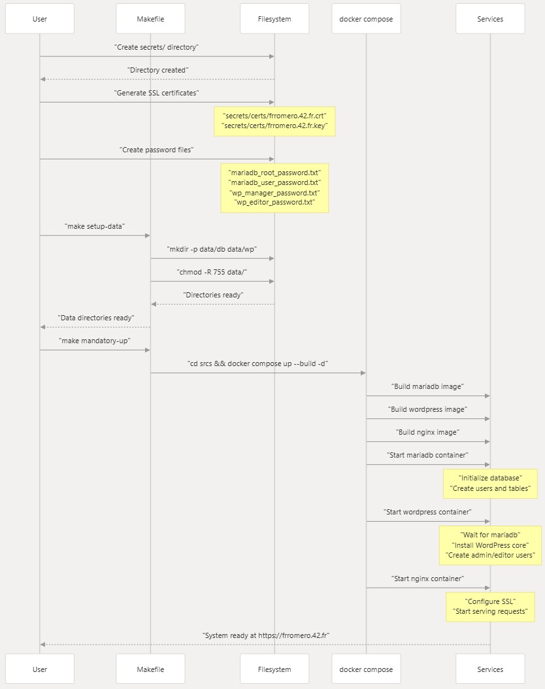

# Quick Start Guide

## Relevant source files

### Purpose and Scope

This guide provides the essential steps to deploy the Inception WordPress stack from a fresh installation. It covers the minimum actions required to get a working system with mandatory services (Nginx, WordPress, MariaDB) running.

For detailed configuration options and environment variable reference, see **Configuration Setup**. For comprehensive information about available Makefile targets and deployment options, see **Deployment Commands**. For understanding the underlying architecture, see **System Architecture**.

---

## Prerequisites

Before beginning deployment, ensure the following are available on the host system:

| Requirement       | Description             | Verification Command         |
|------------------|-------------------------|------------------------------|
| Docker Engine     | Container runtime        | `docker --version`           |
| Docker Compose    | Orchestration tool       | `docker compose version`     |
| Make              | Build automation         | `make --version`             |
| Sudo/Root Access  | For creating data directories | `sudo -v`               |

The system must be accessible via the domain name configured in `.env` (default: `frromero.42.fr`). Add this to `/etc/hosts` if not using actual DNS:

```
127.0.0.1    frromero.42.fr
```


---

## System Deployment Workflow

The following diagram illustrates the complete deployment process from initial setup to a running system:

**Deployment Sequence Diagram**



---

## Step-by-Step Deployment

### Step 1: Create Secrets Directory Structure

```bash
mkdir -p secrets/certs
```

### Step 2: Generate SSL Certificates

```bash
openssl req -x509 -nodes -days 365 -newkey rsa:2048 \
  -keyout secrets/certs/frromero.42.fr.key \
  -out secrets/certs/frromero.42.fr.crt \
  -subj "/C=ES/ST=Madrid/L=Madrid/O=42/OU=42/CN=frromero.42.fr"
```

The certificate files are mounted into the Nginx container as read-only volumes.


---

### Step 3: Create Password Files

Create plaintext password files in the `secrets/` directory. Each file should contain a single password string:

```bash
echo "your_mariadb_root_password" > secrets/mariadb_root_password.txt
echo "your_mariadb_user_password" > secrets/mariadb_user_password.txt
echo "your_wordpress_manager_password" > secrets/wp_manager_password.txt
echo "your_wordpress_editor_password" > secrets/wp_editor_password.txt
```

These files are referenced by Docker Compose secrets and mounted at `/run/secrets/` inside containers.


---

### Step 4: Configure Environment Variables

Edit `srcs/.env` to customize domain and user settings:

| Variable                  | Purpose                     | Default Value         |
|--------------------------|-----------------------------|-----------------------|
| DOMAIN_NAME              | Site domain name            | frromero.42.fr        |
| WORDPRESS_ADMIN_USER     | WordPress admin username    | god                   |
| WORDPRESS_ADMIN_EMAIL    | Admin email address         | god@42.fr             |
| WORDPRESS_REGULAR_USER   | Editor username             | paco                  |
| WORDPRESS_REGULAR_EMAIL  | Editor email                | paco@42.fr            |
| MYSQL_DATABASE           | Database name               | wordpress             |
| MYSQL_USER               | Database username           | db_user               |


---

### Step 5: Initialize Data Directories

Run the Makefile target to create persistent storage directories:

```bash
make setup-data
```

This command executes the following operations:

- Creates `data/db/` for MariaDB data
- Creates `data/wp/` for WordPress files
- Sets ownership to current user
- Sets permissions to `755`


---

### Step 6: Deploy Mandatory Services

Deploy the three core services (MariaDB, WordPress, Nginx):

```bash
make mandatory-up
```

This executes `docker compose up --build -d mariadb wordpress nginx` in the `srcs/` directory, which:

- Builds custom Docker images for each service
- Creates containers with proper network and volume configuration
- Starts containers in dependency order
- Returns control while services initialize in background


---

## Verification Steps

### Check Container Status

Verify all mandatory containers are running:

```bash
cd srcs && docker compose ps
```

Expected output should show three containers in "Up" state:

| Container Name | Status | Ports                          |
|----------------|--------|--------------------------------|
| mariadb        | Up     | 3306/tcp (internal)            |
| wordpress      | Up     | 9000/tcp (internal)            |
| nginx          | Up     | 0.0.0.0:443->443/tcp           |

---

### View Initialization Logs

Monitor service initialization:

```bash
make logs
```

This follows logs from all containers. Key messages to look for:

- **MariaDB**: `[Note] mysqld: ready for connections`
- **WordPress**: `WordPress installation complete`
- **Nginx**: `nginx entered RUNNING state`


---

### Access WordPress Site

Navigate to https://frromero.42.fr in a web browser. You will receive a certificate warning (self-signed certificate). Accept and proceed to see the WordPress site.


---

## Common Operations Summary

| Task               | Command         | Description                                 |
|--------------------|-----------------|---------------------------------------------|
| View logs          | `make logs`     | Follow logs from all containers             |
| Stop services      | `make stop`     | Stop containers without removing them       |
| Restart services   | `make restart`  | Stop and restart mandatory services         |
| Rebuild images     | `make rebuild`  | Rebuild without cache and redeploy          |
| Basic cleanup      | `make purge`    | Stop containers, prune unused resources     |
| Complete cleanup   | `make purge-all`| Remove all containers, images, volumes, data|


---

## Optional: Deploy Bonus Services

To deploy additional services (Adminer database manager and static web server), use the bonus profile:

```bash
make bonus-up
```

This command deploys all services including those with profiles: `[bonus]` in the Docker Compose configuration.

---

## Troubleshooting Quick Reference

| Issue                                | Solution                                                  |
|--------------------------------------|-----------------------------------------------------------|
| Port 443 already in use              | Stop other services using port 443, or modify port mapping|
| Permission denied on data/           | Run `make setup-data` with appropriate privileges         |
| Containers fail to start             | Check logs with `make logs`, verify secrets files exist   |
| Domain not resolving                 | Add domain to `/etc/hosts` pointing to `127.0.0.1`        |
| WordPress shows database error       | Verify MariaDB container is running and healthy           |

